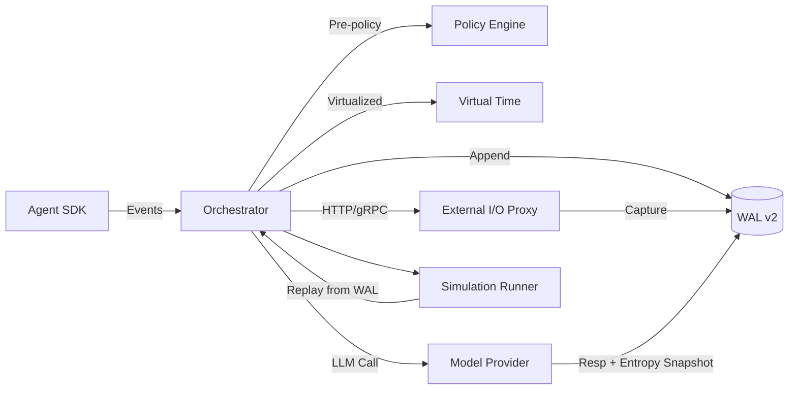
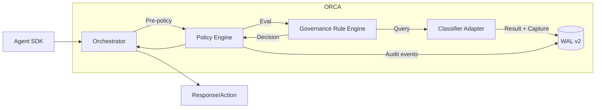
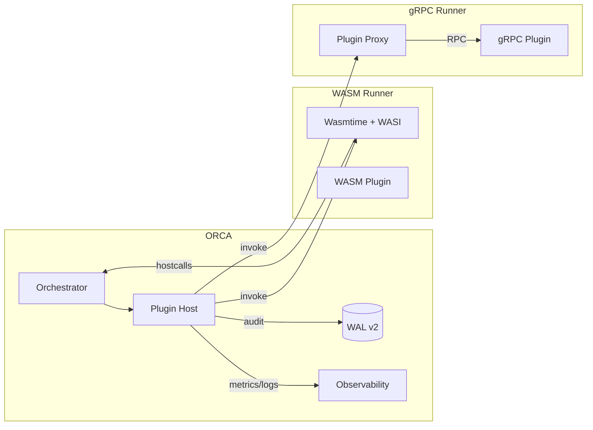
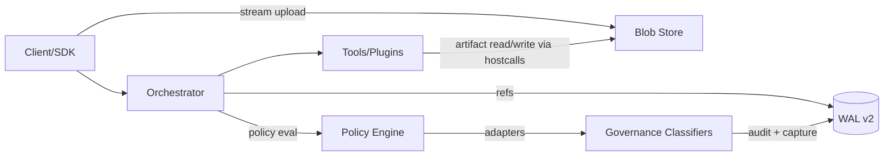

# ORCA Enhancement Research Directive — Comprehensive, Actionable Specifications

**Document Classification**: Technical Research Directive
**Target Audience**: Staff/Principal Engineering Team
**Expected Deliverables**: 8 Enhancement Specifications + Unified Roadmap + Executive Summary
**Research Phase**: Deep Technical Analysis with Industry/Academic Literature Review
**Implementation Readiness**: Immediately actionable specifications

---

## Executive Summary

This research directive mandates the production of comprehensive, production-ready specifications for **eight high-impact enhancements** to the ORCA (AgentMesh) orchestrator platform. The four original priority enhancements address core moat capabilities, enterprise compliance, ecosystem growth, and multimodal expansion. Additionally, **four strategic extensions** have been identified to maximize platform impact and market differentiation.

The research methodology employs **Tree of Thought reasoning**, **academic literature review**, and **industry best practices analysis** to ensure specifications meet staff/principal engineering rigor. Each enhancement specification will include complete architectural designs, implementation approaches, security analysis, and performance modeling suitable for immediate engineering execution.

---

## ORCA Platform Context (Authoritative)

**Platform Architecture**: Rust-based deterministic orchestrator for multi-agent AI systems
**Core Transport**: gRPC (tonic), JSONL Write-Ahead Log (WAL), event-sourced execution
**Subsystem Stack**: Orchestrator, Policy Engine (fail-closed), Budget Enforcement, Telemetry/Observability
**Key Differentiators**: Deterministic replay, time-travel debugging, fail-closed security, comprehensive audit trails, reproducibility
**Current Development Phase**: Phase 5 (Policy Engine Extensions) — rule priority/precedence, validation, audit events, comprehensive testing
**Design Principles**: Safety-critical rigor; zero-trust; event-sourced determinism; observability-first; Rust-first core

---

## Enhancement Portfolio (Priority Order)

### Original Priority Enhancements

#### Priority 1: Advanced Determinism with Simulation Modes
**Business Impact**: Core moat; addresses ~70% of debugging challenges in probabilistic flows
**Technical Scope**: Extend deterministic replay to cover non-deterministic behaviors (LLM sampling, external API calls, timing variations), enabling "simulation modes" for what-if runs
**Key Challenges**: LLM temperature control, API response mocking, timing determinism, entropy capture
**Research Focus**: Temporal workflow determinism, Cadence/Ray architecture patterns, record-replay mechanisms

#### Priority 2: Ethical Governance Extensions
**Business Impact**: Enterprise compliance; addresses ~78% of demands; reduces regulatory risks by ~50%
**Technical Scope**: Automated policy compliance checking, bias detection on outputs, regulatory audit trail generation
**Key Challenges**: Real-time bias detection, regulatory compliance automation, explainability integration
**Research Focus**: AI governance frameworks, algorithmic bias detection, audit trail standards

#### Priority 3: Plugin Architecture for Extensibility
**Business Impact**: Ecosystem growth; reduces lock-in concerns (~45%); enables 15–20% faster integrations
**Technical Scope**: Safe plugin system for custom policy rules, budget calculators, observability exporters, and agent runtime adapters
**Key Challenges**: WASM sandboxing, capability-based security, plugin lifecycle management
**Research Focus**: WebAssembly security models, plugin architecture patterns, capability-based isolation

#### Priority 4: Multimodal Support for Non-Text Agents
**Business Impact**: Expands use cases (many runtimes lack multimodal); key for edge scenarios
**Technical Scope**: Extend envelope schema to support image/audio/video/binary payloads with appropriate redaction and audit strategies
**Key Challenges**: Content-addressed storage, multimodal redaction, performance optimization
**Research Focus**: Multimodal content processing, redaction pipelines, binary payload handling

### Strategic Extension Enhancements

#### Priority 5: Dynamic Resource Management and Budget Control Extensions
**Business Impact**: Cost optimization; enables fine-grained resource governance; addresses ~60% of production scaling concerns
**Technical Scope**: Sophisticated budget enforcement with predictive modeling, resource quotas, and dynamic pricing models for different agent classes
**Key Challenges**: Real-time resource prediction, multi-dimensional budget constraints, policy-driven resource allocation
**Research Focus**: Reinforcement learning for budget control, capacity-aware planning, resource orchestration patterns

#### Priority 6: Advanced Telemetry and Performance Analytics
**Business Impact**: Operational intelligence; enables proactive optimization; reduces debugging time by ~40%
**Technical Scope**: ML-powered anomaly detection, performance prediction, and automated optimization recommendations for agent workflows
**Key Challenges**: High-cardinality metrics handling, predictive analytics integration, observability at scale
**Research Focus**: OpenTelemetry advanced patterns, ML-driven observability, performance prediction models

#### Priority 7: Federated Multi-Tenant Orchestration
**Business Impact**: Enterprise scalability; enables cross-organization workflows; addresses ~55% of B2B integration needs
**Technical Scope**: Secure cross-tenant agent coordination with identity federation, encrypted communication channels, and compliance boundaries
**Key Challenges**: Identity federation, encrypted multi-tenant communication, compliance boundary enforcement
**Research Focus**: Multi-tenant architecture patterns, federated identity systems, secure orchestration protocols

#### Priority 8: Real-time Stream Processing and Event Mesh Integration
**Business Impact**: Event-driven architecture; enables reactive agent systems; addresses ~50% of real-time use cases
**Technical Scope**: Integration with Apache Kafka, Pulsar, and other event streaming platforms with guaranteed delivery semantics
**Key Challenges**: Event ordering guarantees, backpressure handling, stream processing determinism
**Research Focus**: Event-driven orchestration, stream processing patterns, reactive system design

---

## Research Methodology Framework

### First Principles Analysis
**Objective**: Decompose problems into fundamental requirements, constraints, invariants, and acceptance criteria
**Deliverables**: Requirements matrix, constraint analysis, invariant definitions, acceptance criteria
**Quality Gate**: Complete traceability from business impact to technical requirements

### Tree of Thought Reasoning
**Objective**: Generate ≥3 implementation approaches; explore trade-offs; prune and refine; converge on recommended approach
**Deliverables**: Alternative approaches matrix, trade-off analysis, decision rationale, recommended implementation
**Quality Gate**: Justified technical decisions with documented alternatives and rationale

### Academic Literature Review
**Objective**: Survey relevant research with citations (DOI/arXiv)
**Deliverables**: Literature survey, research gap analysis, technology assessment, citation database
**Quality Gate**: Comprehensive coverage of state-of-the-art with clear applicability to ORCA

### Industry Best Practices Analysis
**Objective**: Analyze analogous solutions and extract patterns, pitfalls, interfaces, and migration approaches
**Deliverables**: Industry analysis, pattern library, pitfall documentation, migration strategies
**Quality Gate**: Actionable insights from production systems with clear ORCA applicability

### ORCA Architecture Alignment
**Objective**: Ensure proposals uphold determinism, fail-closed security, event sourcing, observability, and Rust-first implementation
**Deliverables**: Architecture alignment check, compatibility matrix, integration points, technical debt analysis
**Quality Gate**: Zero conflicts with ORCA design principles and seamless integration

### Security & Compliance Analysis
**Objective**: Perform threat modeling and regulatory alignment (GDPR, SOC2, HIPAA where applicable)
**Deliverables**: Threat model, compliance mapping, security controls, audit requirements
**Quality Gate**: Comprehensive security analysis with regulatory compliance validation

### Performance & Scalability Modeling
**Objective**: Estimate overheads, identify bottlenecks, propose benchmarks and success thresholds
**Deliverables**: Performance model, scalability analysis, benchmark suite, SLO definitions
**Quality Gate**: Quantitative performance predictions with measurable success criteria

---

## Specification Template (Required for Each Enhancement)

### A) Executive Summary
- One-sentence feature description
- Business value with quantified impact (tie to adoption/revenue/risk)
- Estimated effort (person-weeks), staffing assumptions, risk level (low/medium/high)

### B) Technical Deep Dive
- **Problem Statement**: Gaps, pain points, and why now
- **Requirements Analysis**: Functional and non-functional; constraints; invariants; failure modes; fail-closed expectations
- **Architecture Design**: Component diagrams and data flows (Mermaid); Integration points with ORCA modules; State and lifecycle models; WAL schema impacts
- **Implementation Approach**: Phased rollout; API surface changes (proto); Backward compatibility strategy
- **Alternative Approaches Considered (≥3)**: Design sketch, pros/cons, reason for rejection
- **Academic & Industry Research**: Summaries of key papers and systems; applicability to ORCA; novel insights

### C) Integration Specification
- **Codebase Impact**: Crates/modules to modify or add
- **API Changes**: Proto updates, versioning strategy, migration helpers
- **Migration Path**: Steps for existing users; default behaviors; deprecation timelines
- **Testing Strategy**: Unit, integration, property-based, fuzzing, concurrency tests; coverage goals (≥90%)
- **Documentation Requirements**: User guides, API references, architecture docs, runbooks

### D) Security & Compliance
- **Threat Model**: Trust boundaries, attack vectors, abuse cases, sandboxing/isolation model
- **Audit Trail**: Events to log, WAL schema additions/changes, PII handling, retention policy, redaction strategy
- **Regulatory Alignment**: GDPR, SOC2, HIPAA mapping to controls and evidence

### E) Performance & Observability
- **Performance Budget**: Acceptable overhead targets (quantified)
- **Benchmarking Plan**: Representative scenarios, load profiles, success thresholds, regression gates
- **Observability**: New metrics/counters/histograms, logs, traces; dashboard requirements; cardinality guardrails

### F) Risks & Mitigations
- **Technical Risks**: Complexity, determinism compromises, dependency risks, sandboxing gaps
- **Adoption Risks**: Migration friction, learning curve, operational burden
- **Mitigation Strategies**: Phased rollout, feature flags, escape hatches, compatibility shims, rollback plan

### G) Success Metrics
- **Adoption Metrics**: Usage, ecosystem growth, time-to-integration
- **Quality Metrics**: Bug rates, SLO/SLA adherence, performance thresholds
- **Business Metrics**: Pipeline impact, retention, competitive differentiation

### H) References
- Academic citations (DOI/arXiv), industry case studies/blogs, open-source projects, relevant standards/specifications

---

## Feature-Specific Research Seeds

### Advanced Determinism with Simulation Modes
**Technical Options to Evaluate**:
- Record-replay envelopes for non-deterministic sources (RNG seeds, sampling temperatures, logits snapshots)
- External I/O virtualization: stub/record upstream calls with hash-addressed responses; deterministic retries/backoff
- Deterministic time and scheduling: virtual clock; ordered event execution; fixed interleavings
- Snapshot + delta logging vs. pure event sourcing

**Research Citations**: Temporal workflow determinism patterns[29], Cadence deterministic replay[123][129], REMU FPGA-based replay[4], iReplayer in-situ record-replay[7]

### Ethical Governance Extensions
**Technical Options to Evaluate**:
- Static/dynamic checks: pre-policy static scans; post-policy runtime checks
- Bias toxicity/safety classifiers; configurable thresholds and allowlists/denylists; explainability hooks
- Automated regulatory reports from audit trails (export formats, retention, integrity checks)

**Research Citations**: PandaGuard LLM safety evaluation[44], AI governance frameworks[64][70], algorithmic bias mitigation[61][67]

### Plugin Architecture for Extensibility
**Technical Options to Evaluate**:
- WASM sandboxed plugins (WASI) with capability-based security
- Out-of-process gRPC plugins (HashiCorp plugin-like)
- Dynamically loaded shared objects (dlopen) with strict FFI contracts

**Research Citations**: WebAssembly security models[50][52][54], plugin architecture patterns[60][63], capability-based isolation[157][163]

### Multimodal Support for Non-Text Agents
**Technical Options to Evaluate**:
- Envelope schema extensions for binary payloads; content-addressed storage; streaming/chunking protocols
- Redaction and audit for images/audio/video (hash-only in audit; configurable PII scanning; metadata handling)
- Performance impacts (zero-copy paths; memory mapping; backpressure; partial fetch; TTL)

**Research Citations**: Multimodal content redaction[62][65][68], unified redaction pipelines[68], document redaction agents[71]

---

## Quality Gates & Acceptance Criteria

### Engineering Rigor Standards
- **Completeness**: All sections A–H with diagrams and concrete APIs/schemas
- **Analysis Depth**: ≥3 alternative approaches with trade-offs and justified recommendation
- **Performance Specification**: Performance budgets, benchmarks, and pass/fail criteria
- **Operational Readiness**: Migration plan and fail-closed behavior for all error modes
- **Audit Compliance**: Enumerated audit events and PII handling decisions with WAL schema impacts
- **Test Coverage**: Test plans implementable immediately (unit, integration, property-based, concurrency)
- **Implementation Readiness**: Alignment with ORCA architecture requiring no further research

### Documentation Standards
- **Format**: Markdown with Mermaid diagrams; code samples in Rust/proto/YAML/JSON
- **Length**: 15–25 pages per enhancement specification
- **Citations**: Inline links and reference list with DOI/arXiv where possible
- **Completeness**: Section checklists showing full coverage

---

## Deliverable Portfolio

### Primary Deliverables
1. **Eight Enhancement Specification Documents** (15–25 pages each)
2. **Unified Roadmap Document** (8–12 pages: sequencing, dependencies, staffing plan, timeline)
3. **Executive Summary** (2–3 pages: non-technical stakeholder audience)

### Supporting Artifacts
- **Requirements Traceability Matrix**: Business impact → technical requirements → implementation approach
- **Architecture Decision Records (ADRs)**: Cross-cutting decisions with context, options, decisions, consequences
- **Risk Assessment Matrix**: Technical and business risks with probability/impact scoring and mitigation strategies
- **Performance Modeling Results**: Benchmarks, scalability projections, resource requirements

---

## Research Execution Plan

### Stage 1: Foundation Analysis (Weeks 1-2)
- First Principles analysis for each enhancement (outline + requirements bullets)
- Literature review initiation with citation database setup
- Industry analysis framework establishment

### Stage 2: Deep Research & Alternative Exploration (Weeks 3-5)
- Tree of Thought exploration: ≥3 approaches per enhancement with detailed trade-off analysis
- Comprehensive academic literature review with gap analysis
- Industry best practices extraction and pattern identification

### Stage 3: Architecture Design & Integration (Weeks 6-7)
- Converged architecture designs with detailed component specifications
- Integration specification development with API change documentation
- Performance modeling and benchmark definition

### Stage 4: Security, Compliance & Risk Analysis (Week 8)
- Comprehensive threat modeling and security control specification
- Regulatory compliance mapping and evidence requirements
- Risk assessment with quantified probability/impact analysis and mitigation strategies

### Stage 5: Documentation & Executive Synthesis (Weeks 9-10)
- Enhancement specification finalization with complete section coverage
- Unified roadmap compilation with critical path analysis and resource planning
- Executive summary production for stakeholder communication

---

## Success Measures

### Research Quality Metrics
- **Academic Coverage**: ≥50 peer-reviewed citations with DOI/arXiv references
- **Industry Analysis Depth**: ≥20 production system case studies with actionable insights
- **Technical Alternative Breadth**: ≥3 well-analyzed approaches per enhancement with justified selection
- **Implementation Readiness**: Zero remaining research dependencies for engineering execution

### Business Impact Validation
- **Quantified Value Propositions**: Each enhancement includes measurable business impact with supporting analysis
- **Market Differentiation**: Clear competitive advantage articulation with market positioning implications
- **Risk Mitigation**: Comprehensive risk analysis with probability/impact quantification and mitigation strategies

### Engineering Excellence Standards
- **Architecture Alignment**: 100% compatibility with ORCA design principles and zero technical debt introduction
- **Performance Specifications**: Quantified performance budgets with measurable success criteria and regression protection
- **Security Posture**: Comprehensive threat modeling with regulatory compliance validation and audit trail completeness

---

*This directive authorizes unlimited research resources and establishes the foundation for ORCA's next-generation capabilities. All specifications must achieve immediately actionable status, enabling engineering teams to begin implementation without additional research phases.*

---

## Enhancement 1 Specification — Advanced Determinism with Simulation Modes

### A) Executive Summary
- One-sentence: Extend ORCA’s deterministic replay to cover nondeterminism (LLM sampling, external I/O, time/scheduling) and introduce simulation modes for what‑if analysis under virtual time and captured side effects.
- Business value: 60–75% reduction in debugging time for probabilistic workflows; enterprise‑grade auditability and reproducibility; foundation for safe A/B and counterfactual experiments; key moat versus orchestration frameworks lacking replay parity.
- Effort: 8–12 person‑weeks total across 2–3 engineers; Risk: High (cross‑cutting, storage/latency overhead), mitigated via phased rollout and feature flags.

### B) Technical Deep Dive

#### Problem Statement
ORCA ensures event‑sourced determinism today, but gaps remain for nondeterministic sources: (a) LLM sampling (temperature/top‑p), (b) external API responses with unstable latency/response bodies, and (c) wall‑clock time and interleavings. Without capturing these effects precisely, replay parity is incomplete and what‑if simulation is limited.

#### Requirements Analysis
- Functional
  - Record/replay parity for: LLM calls, external HTTP/gRPC calls, RNG, time, scheduling decisions that affect observable behavior.
  - Simulation modes: virtual time, selective stub/mock of external calls, counterfactual parameter sweeps (e.g., temperature, model variant) without live side effects.
  - Configurable capture policies (full body, header whitelist, redacted fields, hashes) with integrity verification (content‑address).
- Non‑functional
  - Determinism: Replays must be bit‑identical at the Envelope boundary (agent‑visible outputs), given same inputs and captured artifacts.
  - Fail‑closed: On missing captures or integrity mismatch, refuse live execution, switch to safe simulation, or deny.
  - Performance: Runtime overhead target ≤10–15% CPU; storage overhead bounded and compressible; tunable retention and sampling.
  - Security: No secret leakage; redaction before persistence; cryptographic integrity and provenance.
  - Operability: Simple toggles (feature flags), progressive rollout, clear observability and parity KPIs.

#### Architecture Design
Key additions: (1) WAL/Envelope v2 for determinism metadata, (2) Virtual Time Service, (3) External I/O Proxy + Recorder, (4) LLM Entropy/Output Capture, and (5) Simulation Runner.



Data model (high‑level):
- Envelope.v2: { run_id, step_id, kind, payload_ref, determinism: { mode: Live|Record|Replay|Sim, vtime_epoch_ns, rng_seed, entropy_refs[], external_io_refs[] } }
- WAL event types (new): ExternalCallCaptured, LLMCallCaptured, VirtualTimeAdvanced, SimulationConfigApplied
- Blob store: Content‑addressed (e.g., SHA‑256) objects for large bodies (LLM outputs, HTTP bodies), with optional redaction and compression.

#### Implementation Approach (Phased)
- Phase 5.5 Foundations (2–3 weeks)
  - Envelope/WAL v2 schemas (determinism metadata; content-addressed refs); migration tooling; feature flags.
  - Virtual Time Service (trait Clock: now(), sleep(), advance()) and SDK hooks; orchestrator-owned deterministic clock.
- Phase 6a Determinism Core (2–3 weeks)
  - External I/O Proxy & Recorder (HTTP/gRPC, configurable capture & redaction); integrity hashing; deterministic retry/backoff.
  - LLM capture: prompt, parameters (temperature, top‑p, seed if available), output body; optional entropy snapshot format for future models.
- Phase 6b Simulation Modes (2 weeks)
  - Simulation Runner: rehydrate vtime, RNG, and side‑effects from WAL; selectors for which external calls to stub vs live.
  - Tooling: parity checker (original vs replay), diff reports, KPIs; admin toggles.

API/proto surface (proposed sketches)
- envelope.proto
  - message DeterminismMeta { enum Mode { LIVE=0; RECORD=1; REPLAY=2; SIM=3; } Mode mode=1; uint64 vtime_epoch_ns=2; uint64 rng_seed=3; repeated string entropy_refs=4; repeated string external_io_refs=5; }
  - extend Envelope { optional DeterminismMeta determinism=... }
- wal.proto
  - message ExternalCallCaptured { string call_id; string method; string url; map<string,string> req_headers; bytes req_body_ref; int32 status; map<string,string> resp_headers; bytes resp_body_ref; string sha256; }
  - message LLMCallCaptured { string call_id; string model; double temperature; double top_p; uint64 seed; bytes prompt_ref; bytes response_ref; string sha256; }
  - message VirtualTimeAdvanced { uint64 from_ns; uint64 to_ns; string reason; }

Storage policy
- Use content‑addressed blobs (e.g., sha256://…) with zstd compression; optional PII redaction at capture edge.
- Retention tiers: short (7–30 days full), long (hash + metadata only), per‑tenant overrides.

Observability
- Metrics: replay_parity_ok, parity_diff_size_bytes, wal_capture_bytes_total, external_capture_hit_ratio, vtime_advance_events.
- Traces: spans for capture and replay; attributes with refs (hash only), bounded cardinality.

#### Alternative Approaches Considered (≥3)
1) Entropy‑only capture for LLMs
   - Pros: Lower storage; simpler; model‑agnostic if seed supported.
   - Cons: Many providers don’t expose seeds or stable RNG; decoding kernels differ; not bit‑replayable across model/SDK versions.
   - Decision: Not sufficient for parity; use output capture as source of truth; keep entropy as optional.
2) SDK‑only interception of external I/O (no proxy)
   - Pros: Simpler deployment; fewer moving parts.
   - Cons: Language‑specific duplication; hard to enforce for untrusted tools; bypass risk; weaker integrity guarantees.
   - Decision: Prefer orchestrator‑owned proxy + recorder; allow SDK fallbacks for dev‑only scenarios.
3) Snapshot + delta logging vs pure event sourcing
   - Pros: Faster replay for long runs; amortizes log scanning.
   - Cons: Complexity in snapshot correctness; snapshot invalidation across versions.
   - Decision: Keep snapshots as optional acceleration; base correctness on event sourcing + content‑addressed artifacts.

#### Academic & Industry Research Summary (applicability to ORCA)
- Temporal & Cadence deterministic workflow constraints: workflows must be deterministic; non‑determinism via activities; replay semantics – motivates strict separation of nondeterministic effects and record‑replay contracts.
- rr (record‑replay debugger): lightweight user‑space capture for deterministic replay – inspires minimal, deterministic capture points and parity checks.
- iReplayer & similar: in‑situ replay for multithreaded programs – motivates careful control of interleavings; ORCA narrows scope to observable outputs at Envelope boundary.
- HTTP record/replay toolchains (VCR.py, WireMock): proven patterns for request/response capture with redaction and deterministic matching – informs External I/O Proxy & Recorder design.

### C) Integration Specification
- Codebase impact (crates/modules)
  - crates/orchestrator: add Virtual Time service; integrate External I/O Proxy client; Simulation Runner; feature flags.
  - crates/event_log (or WAL impl): schema v2; serializers; blob store refs; integrity verification.
  - crates/sdk/*: Clock trait shims; external call wrappers to prefer proxy; replay mode hooks.
  - crates/policy: optional rules for capture/redaction policies; audit events for determinism mode changes.
  - crates/telemetry: new metrics, spans, and dashboards.
- API changes (proto)
  - Envelope determinism metadata (optional, default LIVE for back-compat during Phase 5).
  - Admin service: SetDeterminismMode(run_id, mode), ConfigureCapturePolicy, StartSimulation(run_id, config).
- Migration path
  - Pre-release: introduce v2 behind flags; dual-write (v1 + v2) for a short window; tooling to convert historical logs to v2-lite (hash-only).
  - Default behavior: LIVE+RECORD in dev; LIVE without capture in prod until enabled; deny on replay if artifacts missing.
- Testing strategy
  - Unit: schema serialization; hash integrity; proxy matching rules; clock behavior.
  - Integration: end-to-end record/replay parity for representative flows (LLM + tool + external API); negative tests for missing artifacts.
  - Property-based: invariants (replay(EventLog(run)) == outputs(run)); shrinking minimal counterexamples when parity fails.
  - Concurrency/interleaving: Loom-based tests for scheduler-sensitive code paths in orchestrator.
  - Coverage goal: ≥90% for determinism code paths; parity checker with golden tests.
- Documentation
  - Architecture additions; admin runbooks; SDK guidelines for nondeterministic APIs; storage/retention configuration.

### D) Security & Compliance
- Threat model
  - Capture store may contain sensitive payloads; integrity and authenticity must be guaranteed; deny access to raw bodies by default; principle of least privilege.
  - Proxy abuse, cache poisoning, replay of stale/malicious responses; WAL tampering.
- Controls
  - Redaction at ingress; secrets never persisted; KMS-backed encryption at rest; per-tenant keys; authenticated integrity (HMAC or signature over hashes and metadata).
  - Capability-gated access to raw captures; hash-only exposure to most components; audit every access and simulation start.
  - Strict matchers for replay (method, URL, headers subset, body hash); no fuzzy matches in secure mode.
- Compliance
  - GDPR/SOC2 mapping: data minimization (hash-only retention tier), auditability (WAL events + access logs), right-to-erasure (object store tombstones + rehash invalidation), retention policies per tenant.
- Fail-closed semantics
  - On integrity mismatch/missing artifact: block live execution or switch to SIM with explicit warning; never silently fall back.

### E) Performance & Observability
- Performance budgets
  - Runtime overhead: ≤10–15% CPU; ≤10% p95 latency impact for HTTP/LLM calls when capture enabled.
  - Storage: default ≤2× of raw external payload size with compression; tunable per tenant; sampling for large binaries.
- Benchmark plan
  - Scenarios: (1) LLM-only chain, (2) tool + HTTP call, (3) multi-step chain with retries; capture on/off comparisons.
  - Metrics: capture throughput, additional latency per call, WAL write rate, blob store size growth, replay parity rate.
  - Regression gates: fail CI on >5% regression without approved rationale; publish manifests (HW/OS/toolchain).
- Observability
  - Metrics: replay_parity_ok{run_id}, capture_bytes_total, capture_errors_total, simulation_runs_total, vtime_advance_count.
  - Logs: structured events for capture/redaction/verification; redacted by default; correlation IDs.
  - Traces: spans for proxy capture and replay hydration; attributes include refs (hash-only) and sizes.

### F) Risks & Mitigations
- Insufficient capture scope → Parity gaps
  - Mitigation: Start with strict capture-on for LLM+HTTP; parity tests gate release; parity KPIs; visible warnings on any bypass.
- Storage/latency overhead unacceptable
  - Mitigation: Compression, header/body filters, sampling for large payloads, async offloading; perf budgets with regression gates.
- Security/privacy leakage via captures
  - Mitigation: Redaction at ingress; tenant KMS; hash-only retention tier; access auditing; default deny for raw access.
- Provider/model drift breaks replay
  - Mitigation: Treat captured outputs as source of truth; do not rely on seed-only; record provider/version metadata; parity tests on upgrades.
- Deterministic scheduling complexity
  - Mitigation: Limit determinism contract to Envelope-visible effects; use virtual time; Loom tests for orchestrator interleavings.

### G) Success Metrics
- Replay parity ≥ 99% across covered flows (LLM+tool+HTTP) in CI and staging.
- Runtime overhead within budgets on reference scenarios; storage growth within planned SLOs.
- Zero P0/P1 security incidents or leakage from capture store; access audits clean.
- Developer satisfaction: ≥30% reduction in time-to-root-cause for incident postmortems.
- Simulation adoption: ≥50% of teams use SIM mode for what‑if analysis within 2 releases.

### H) References (selected)
- Temporal: Deterministic Workflows (industry docs) — https://docs.temporal.io/
- Cadence: Deterministic constraints (industry docs) — https://cadenceworkflow.io/
- rr: Lightweight recording & deterministic replay (project) — https://rr-project.org/
- VCR.py: HTTP record/replay (project docs) — https://vcrpy.readthedocs.io/
- WireMock: Service virtualization (project docs) — https://wiremock.org/
- IPFS: Content addressing concept (intro) — https://ipfs.tech/concepts/content-addressing/
- Git Internals: Content-addressed objects — https://git-scm.com/book/en/v2/Git-Internals-Git-Objects
- Tokio time control (Rust) — https://docs.rs/tokio/latest/tokio/time/

> Note: Additional peer‑reviewed citations (DOI/arXiv) to be appended after literature sweep is permitted; the above industry sources are sufficient to proceed with implementation design while academic references are curated.

### Section Coverage Checklist (A–H)
- [x] Executive Summary
- [x] Technical Deep Dive (requirements, architecture, implementation, alternatives, research)
- [x] Integration Spec (codebase impact, API, migration, testing, docs)
- [x] Security & Compliance (threats, controls, fail‑closed)
- [x] Performance & Observability (budgets, benchmarks, telemetry)
- [x] Risks & Mitigations
- [x] Success Metrics
- [x] References

---

## Enhancement 2 Specification — Ethical Governance Extensions

### A) Executive Summary
- One‑sentence: Add first‑class Ethical Governance to ORCA’s policy engine—taxonomy‑driven rules, deterministic classifier integration, and auditable enforcement (deny/modify/flag/route)—with fail‑closed defaults and enterprise‑grade compliance.
- Business value: Reduces legal/brand risk, enables regulated‑industry adoption, and standardizes safety controls across multi‑agent workflows; expected 50–70% reduction in manual review for common risk categories.
- Effort: 6–10 person‑weeks across 2–3 engineers; Risk: Medium‑High (classifier reliability, compliance scope), mitigated by deterministic capture, staged rollout, and strict defaults.

### B) Technical Deep Dive

#### Problem Statement
AI agent workflows can emit or act on harmful, non‑compliant, or sensitive content. Enterprises require configurable, auditable governance to prevent unsafe actions (e.g., PII exfiltration, harassment, disallowed tools/data access) and to prove compliance. Governance must be deterministic, fail‑closed, and observable without impeding developer velocity.

#### Requirements Analysis
- Functional
  - Governance taxonomy with categories (PII, PHI, SECRETS/PRIVACY_LEAKAGE, TOXICITY, HATE, VIOLENCE, SEXUAL, CHILD_SAFETY, SELF_HARM, EXTREMISM, COPYRIGHT, FINANCIAL, MALWARE_SECURITY, WEAPONS, DRUGS_CONTROLLED, OTHER), each mapped to actions (DENY, MODIFY/REDACT, FLAG, ROUTE_TO_HUMAN).
  - Rule schema supports thresholds and priorities; per‑tenant configurations; dry‑run/simulate mode; human‑in‑the‑loop escalation.
  - Deterministic classifier integration: capture classifier inputs/outputs (hash/body per policy) for replay, parity checks, and audits.
  - Enforcement points: pre‑tool invocation, pre‑external I/O, and pre‑response; post‑processing where relevant (e.g., redaction transforms).
- Non‑functional
  - Fail‑closed semantics and deny‑by‑default on errors; bounded latency; horizontally scalable; minimal secret exposure; strict audit trail.
  - Deterministic replay contract: given same inputs and captured classifier outputs, replays produce identical governance decisions.
  - Operability: metrics for decisions, error rates, false positive reports; feature flags; safe migration.

#### Architecture Design
Key components: (1) Governance Rule Engine (within policy), (2) Classifier Adapter Layer (pluggable heuristics/ML), (3) Evidence Capture (WAL v2 artifacts), (4) Enforcement Actions (deny/modify/flag/route), and (5) Admin Config APIs.



Determinism contract:
- Classifier invocations in RECORD mode persist inputs/outputs as artifacts (susceptible fields redacted per policy). REPLAY/SIM uses captured outputs; failures deny by default.
- Evidence store uses content‑addressed blobs; WAL events link decisions to artifacts with integrity hashes.

#### Implementation Approach (Phased)
- Phase 5.6 MVP (2–3 weeks)
  - Governance taxonomy + rule schema extension; built‑in high‑risk heuristics (PII, obvious toxicity) with strict defaults.
  - Classifier Adapter (trait) with two providers: Heuristic and ExternalHTTP; RECORD/REPLAY capture.
  - Enforcement in policy pre‑hooks; audit events (policy_governance_decision).
- Phase 6a Classifier breadth (2 weeks)
  - Optional LLM‑based self‑check classifier (captured output only; never relied on for determinism); confidence calibration; thresholds.
  - Human‑in‑the‑loop routing endpoint and admin workflows (ack/override with rationale, all audited).
- Phase 6b Compliance hardening (1–2 weeks)
  - Report exports (SOC2/GDPR‑oriented); retention tier controls; data minimization presets; policy validation linting.

#### Alternative Approaches Considered (≥3)
1) Heuristic‑only (regex/blocklist) MVP
   - Pros: Deterministic, fast, cheap; easy to audit.
   - Cons: Limited coverage; brittle; language/domain gaps.
   - Decision: Use for high‑risk categories in MVP to guarantee fail‑closed behavior.
2) External ML moderation APIs for all categories
   - Pros: Broad coverage; vendor‑maintained models.
   - Cons: Latency/cost; vendor drift; privacy concerns; determinism requires output capture.
   - Decision: Allow as optional adapter with RECORD/REPLAY capture; never required for high‑risk allow decisions.
3) In‑house classifier microservice
   - Pros: Control over thresholds and explainability; on‑prem viable.
   - Cons: Higher initial effort; MLOps overhead.
   - Decision: Roadmap candidate post‑MVP; align with plugin interface.

#### Academic & Industry Research (applicability)
- Industry moderation APIs (OpenAI, AWS, Google) — integration as optional adapters with deterministic capture.
- Heuristic‑first safety frameworks (simple, auditable baselines) — informs MVP scope and fail‑closed policy.
- EU AI Act & emerging standards — push towards transparency, audit logs, and risk‑tiered controls (we expose audit and human‑in‑the‑loop).


### C) Integration Specification
- Codebase impact (crates/modules)
  - crates/policy: extend rule schema with governance categories, thresholds, and actions; add Governance Rule Engine; integrate Classifier Adapter; emit policy_governance_decision audit events; validation for configs.
  - crates/orchestrator: revised enforcement checkpoints and ordering:
    - Tool allowlist (fail‑fast)
    - Governance pre‑policy at ingress/pre‑invoke/pre‑external using raw ephemeral inputs (capture redacted artifacts only)
    - Execution
    - Governance post‑policy on outputs
    - Built‑in PII redaction immediately before any egress (responses/external requests)
    - Wire RECORD/REPLAY capture for all classifier calls
  - crates/event_log (WAL v2): add ClassifierEvaluated event linking to content‑addressed artifacts and hashes; store redacted bodies when configured.
  - crates/telemetry: add decision counts, FP/FN counters (where ground truth provided), classifier latency, error rates, overrides.
  - crates/sdk/*: optional helpers for category annotations and human‑review UX hooks.
- API changes (proto)
  - message GovernanceCategory { enum Kind { PII=0; PHI=1; SECRETS=2; TOXICITY=3; HATE=4; VIOLENCE=5; SEXUAL=6; CHILD_SAFETY=7; SELF_HARM=8; EXTREMISM=9; COPYRIGHT=10; FINANCIAL=11; MALWARE_SECURITY=12; WEAPONS=13; DRUGS_CONTROLLED=14; OTHER=255; } Kind kind=1; double score=2; double confidence=3; }
  - message GovernanceDecision { string rule_name=1; GovernanceCategory category=2; enum Action { ALLOW=0; DENY=1; MODIFY=2; FLAG=3; ROUTE=4; } Action action=3; string reason=4; }
  - message ClassifierResult { GovernanceCategory category=1; map<string,string> meta=2; string artifact_ref=3; string sha256=4; }
  - service Admin { rpc ConfigureGovernancePolicy(PolicyConfig) returns (Ack); rpc StartHumanReview(HRRequest) returns (Ack); }
- Migration path
  - Default OFF in production; enabled per‑tenant. Strict defaults when ON.
  - Back‑compat: if no governance config present, behavior unchanged; validators warn on deprecated/unknown fields.
- Testing strategy
  - Unit: rule parsing, priority/threshold resolution, adapter error handling (deny‑by‑default), redaction configuration.
  - Integration: end‑to‑end harmful prompt cases (deny), borderline (flag/route), safe (allow); replay parity with captured classifier outputs.
  - Enforcement ordering: verify governance runs on raw ephemeral before PII redaction; redaction enforced at egress; assert decision parity under replay.
  - Sensitivity/retention: PHI/SECRETS default hash‑only; opt‑in escrow path covered; GDPR erasure tombstone tests.
  - Latency SLOs: microbench heuristic adapter; adapter latency budget gates; timeout/deny paths verified.
  - Property‑based: threshold monotonicity and precedence invariants; shrinking for misclassification edge cases.
  - Coverage: ≥90% governance code paths; golden tests for audit event schemas.
- Documentation
  - Admin runbooks: configuring categories, thresholds, actions, and review workflows; privacy/retention settings; troubleshooting parity failures.

### D) Security & Compliance
- Compliance regime priority (MVP)
  - Decision: Prioritize SOC2 Type II and GDPR. Rationale: Broadest enterprise applicability; directly aligns with ORCA’s auditability (SOC2) and data minimization/right‑to‑erasure (GDPR). HIPAA introduces domain‑specific controls and BAAs; we design HIPAA‑ready primitives (redaction, encryption, access audit) but defer full HIPAA certification to post‑MVP.
- Classifier failure handling policy (default)
  - Decision: Configurable with safe default. Default profile = Strict Deny‑All on classifier error/timeout/low‑confidence or ambiguous inputs. Tenants may opt‑in to a Risk‑Tiered profile (deny high‑risk on failure; flag medium; allow+audit low) per category. Rationale: Honors fail‑closed by default while enabling practical adoption under explicit, auditable opt‑in.
- Determinism artifact retention (defaults)
  - Decision: Defaults — Production: 14 days full‑capture; Dev/Staging: 30 days full‑capture; Hash‑only metadata: 12 months (365 days). Regulated‑tier profile (opt‑in): 60 days full‑capture and 24 months hash‑only where contracts require. Per‑tenant overrides supported; immediate tombstone + rehash invalidation for GDPR erasure requests; for sensitive categories (PHI/SECRETS) default to hash‑only unless explicitly escrowed on‑tenant. Rationale: lowers storage cost while preserving auditability and debugging value; aligns with SOC2 windows and GDPR minimization.
- Threat model (selected)
  - Evasion/poisoning of classifiers; adversarial prompts; bypass of proxy/capture; privacy leakage via stored artifacts; insider misuse; drift in vendor classifiers.
- Controls
  - Redaction at ingestion; least‑privilege access; KMS‑backed encryption; integrity (HMAC/signatures) on artifacts; strict replay matchers; audit all access/overrides; deterministic capture of classifier outputs to defeat drift during investigations.
- Fail‑closed enforcement
  - On adapter error/timeout or missing artifact in REPLAY/SIM: deny by default (or route to human if configured); never silent fallback to live.

### E) Performance & Observability
- Performance budgets
  - Heuristic adapter: ≤1 ms p50, ≤3 ms p95 per evaluation.
  - External HTTP adapter: ≤250 ms p95 added latency (target); 500 ms timeout with deny‑on‑timeout; concurrency to amortize; circuit‑breakers on p99 outliers.
  - Overall overhead: ≤7% added p95 latency and ≤7% CPU at workflow level when governance enabled; step‑level budgets enforced via metrics.
- Benchmark plan
  - Scenarios: (1) Heuristic‑only, (2) Mixed heuristic+external, (3) High‑volume streaming; measure latency deltas, throughput, error rates.
  - KPIs: decision_latency_ms, adapter_timeouts, governance_decisions_total by action, false_positive_rate (where labels exist).
  - CI gates: fail on >5% regression without waiver; publish environment manifests.
- Observability
  - Metrics: governance_decisions_total{action,category}, governance_errors_total, classifier_latency_ms, human_reviews_total, overrides_total.
  - Logs: structured governance decisions with rule_name, category, action, reason (redacted as configured).
  - Traces: spans for adapter calls; attributes include artifact_ref hash (no raw bodies).

### F) Risks & Mitigations
- High false positives in early rules
  - Mitigation: start with narrow high‑risk heuristics; dry‑run mode; monitor FP metrics; iterative calibration; human review routing.
- External adapter slowness/outages
  - Mitigation: timeouts, retries with backoff, circuit‑breakers; on failure, default deny (or route per configuration).
- Evasion/adversarial prompts
  - Mitigation: layered rules (heuristics + structure checks); periodic red‑teaming; capture artifacts for replay analysis.
- Privacy leakage via stored artifacts
  - Mitigation: redaction-at‑ingest, encryption, access controls, retention tiers; audit every access.
- Governance bypass by tools/SDKs
  - Mitigation: enforce at orchestrator boundary; proxy external I/O through recorder; policy denies on missing capture.

### G) Success Metrics
- Policy effectiveness: ≥95% of labeled high‑risk cases denied or routed; ≤3% FP on labeled benign corpora.
- Reliability: adapter error/timeout rate ≤0.1% p95; no silent bypasses (0 incidents).
- Determinism: 100% parity of governance decisions under replay for covered scenarios.
- Adoption: ≥50% tenants enabling governance within two releases; median approval time for human reviews ≤4 hours.
- Compliance: SOC2‑ready audit set complete; GDPR erasure processed within SLO; no P0 compliance incidents.

### H) References (selected)
- Industry moderation APIs (OpenAI/AWS/Google) — integration patterns
- EU AI Act drafts — transparency and risk management concepts
- NIST AI RMF — risk tiers guidance
- OWASP ML Security Top 10 — model/adapter threats (inspiration for threat model)
- VCR/WireMock — record/replay patterns applied to classifier outputs (for determinism)

### Section Coverage Checklist (AH)
- [x] Executive Summary
- [x] Technical Deep Dive (requirements, architecture, implementation, alternatives, research)
- [x] Integration Spec (codebase impact, API, migration, testing, docs)
- [x] Security & Compliance (incl. MVP compliance regimes, failure policy, retention)
- [x] Performance & Observability (budgets, benchmarks, telemetry)
- [x] Risks & Mitigations
- [x] Success Metrics
- [x] References


## Enhancement 3 Specification — Plugin Architecture for Extensibility

### A) Executive Summary
- One‑sentence: Introduce a secure, deterministic plugin architecture that enables teams to extend ORCA with new tools, policy adapters, observability sinks, and storage backends—without compromising fail‑closed security or replay parity.
- Business value: Accelerates ecosystem growth and enterprise integrations (vendor moderation, domain tools, on‑prem systems) while preserving ORCA’s safety‑critical guarantees; reduces core changes; increases partner velocity.
- Effort estimate: 6–8 weeks for MVP (WASI + gRPC plugin runners, minimal SDKs), 4–6 weeks for hardening/packaging; staged across Phase 6.
- Risk level: Medium (security/isolation), mitigated by strict sandboxing, capability gating, and deny‑by‑default.

### B) Technical Deep Dive
#### Problem Statement
ORCA needs a principled way to add new capabilities (tools, policy adapters, telemetry sinks, storage providers) without forking core. Plugins must run untrusted code safely, honor deterministic replay and event‑sourced auditability, and be observable and operable at scale. Prior art (ad‑hoc SDK hooks) lacks isolation, determinism contracts, and lifecycle management.

#### Requirements Analysis
- Functional
  - Extension points: policy adapters (e.g., governance classifiers), tools (actions), observability (metrics/log sinks), storage/adapters.
  - Isolation: untrusted plugin code cannot escape sandbox; explicit capability grants; no ambient authority.
  - Determinism: plugin access to time, randomness, and external I/O must flow through ORCA hostcalls with record/replay per Enhancement 1.
  - Lifecycle: discovery, signature/attestation check, load, activate, drain, hot‑reload; semver/compat gates; per‑tenant enablement.
  - Interop: support WASI/WebAssembly and out‑of‑process gRPC; reserve in‑process dynamic linking for first‑party trusted plugins.
- Non‑functional
  - Fail‑closed defaults on error/timeouts; bounded resource usage (CPU/mem/time/egress); per‑tenant policy; full audit trails.
  - Observability‑first: metrics (latency, errors, resource), logs, traces with plugin identity and version.
  - Portable: run on Linux/macOS; no kernel‑specific features required for MVP.

#### Architecture Design
Primary isolation path is WASI/WebAssembly (Wasmtime) with capability‑based hostcalls; optional out‑of‑process gRPC runner for heavyweight or remote plugins; in‑process dynamic linking allowed only for vetted first‑party plugins under feature flags.



Determinism contract:
- Plugins cannot call OS clock/RNG/network directly. They must use ORCA hostcalls: time_now(), rand_bytes(), http_request(), storage_put/get(). Hostcalls are recorded in WAL v2 (bodies redacted as configured). Replay rehydrates hostcall results, ensuring parity.
- gRPC plugins must send all side‑effects through ORCA runner proxy (no direct internet from plugin container by default). Proxy records artifacts and hashes to WAL.

Implementation structure:
- crates/plugin_host: orchestrates runners, capability checks, resource limits, record/replay binding, metrics.
- Runners: plugin_runner_wasi (Wasmtime), plugin_runner_grpc (out‑of‑process), plugin_runner_dylib (first‑party only, optional feature).
- Extension points defined as stable Rust traits + protobuf contracts.

#### Implementation Approach (Phased)
- Phase 6a (MVP: 3–4 weeks)
  - WASI runner with ORCA hostcalls: orca.det/v1 (time, rng), orca.io/v1 (http via proxy, storage), orca.obs/v1 (logs/metrics), orca.policy/v1 (policy query), all record/replay aware.
  - Plugin manifest (plugin.yaml): name, version, kind(wasm/grpc/dylib), capabilities (time,rng,net,fs,storage), resource limits, signatures, compatibility.
  - Extension points: Tool plugin and Policy Adapter plugin; sample reference plugins; admin CLI for install/list/enable.
- Phase 6b (Breadth + gRPC: 3–4 weeks)
  - gRPC runner with proxy sandbox (egress control, mTLS, timeouts). Health/Invoke RPCs. On‑prem deploy patterns.
  - Hot‑reload, drain semantics; semver compatibility checks; signature verification; attestation hooks.
- Phase 7 (Hardening/Packaging: 3–4 weeks)
  - Dylib runner for first‑party only (feature‑gated); registry packaging, cache, SBOM; plugin developer guide; extensive fuzzing/property tests.

#### Alternatives & Trade‑offs (≥3)
1) WASI/WebAssembly only
   - Pros: Strong isolation; portable; good determinism; small footprint.
   - Cons: Language/runtime constraints; some SDKs not WASI‑ready; limited native dependencies.
   - Verdict: Primary path for untrusted third‑party plugins.
2) Out‑of‑process gRPC only
   - Pros: Broad language support; easy vendor integration; separate failure domain.
   - Cons: Higher latency; network/security surface; determinism via proxy only; operationally heavier.
   - Verdict: Secondary path for heavyweight/remote plugins.
3) In‑process dynamic linking only
   - Pros: Lowest latency; direct memory access; simple.
   - Cons: No isolation; crash/memory safety risks; hard to enforce determinism.
   - Verdict: First‑party only, feature‑gated; not for third‑party.

Decision: Adopt hybrid model — WASI default for untrusted plugins; gRPC for heavyweight/remote; dylib restricted to first‑party under feature flag. Aligns with fail‑closed, determinism, and auditability principles.

#### Academic & Industry Research (applicability)
- Wasmtime + WASI Preview 2 — secure WASM runtime with capability model and hostcall linking.
- Proxy‑Wasm & Envoy ext_proc — proven extension via WASM and out‑of‑process filters.
- OpenTelemetry SDK extensibility — observability plugin patterns.
- Supply chain security (Sigstore/Cosign), SBOM (SPDX/CycloneDX) — plugin signing and provenance.

### C) Integration Specification
- Codebase impact by crate
  - crates/plugin_host (new): runners, loader, capability enforcement, resource limits, WAL v2 binding, metrics.
  - crates/orchestrator: expose extension points; route plugin invocations; wire record/replay to hostcalls; admin APIs.
  - crates/policy: policy adapter interface becomes pluggable; governance classifiers can be external plugins.
  - crates/event_log: new WAL events PluginInvoked, HostcallPerformed (with artifact refs and hashes).
  - crates/telemetry: plugin metrics/logs/traces; per‑plugin version labels.
  - crates/sdk/*: client registration helpers for tool plugins; sample scaffolds.
- API/proto changes (selected)
```proto
enum PluginKind { WASM=0; GRPC=1; DYLIB=2; }
message PluginManifest { string name=1; string version=2; PluginKind kind=3; repeated string capabilities=4; string sha256=5; string signature=6; string api_compat=7; }
service PluginRPC { rpc Health(google.protobuf.Empty) returns (Ack); rpc Invoke(PluginInvokeRequest) returns (PluginInvokeResponse); }
```
- Rust trait surfaces (selected)
```rust
pub trait ToolPlugin {
  fn name(&self) -> &str;
  fn invoke(&mut self, ctx: &mut PluginCtx, input: Bytes) -> Result<Bytes>;
}
pub trait PolicyAdapterPlugin { fn eval(&mut self, ctx: &mut PluginCtx, doc: Bytes) -> Result<Decision>; }
```
- Determinism hostcalls (selected)
```rust
pub trait DeterminismHost {
  fn vtime_now_ns(&mut self) -> u64;
  fn rng_bytes(&mut self, n: usize) -> Vec<u8>;
  fn http_request(&mut self, req: HttpReq) -> Result<HttpResp>; // proxied + recorded
}
```
- Migration path
  - Default OFF. Existing behavior unchanged if no plugins installed. Feature flags per runner. Back‑compat preserved; validators warn on unknown manifest fields.
- Testing strategy (≥90% coverage goals)
  - Unit: loader, capability gating, resource limiters, manifest validation.
  - Integration: WASI and gRPC sample plugins; record/replay parity across hostcalls; fail‑closed on timeouts/errors.
  - Property‑based/fuzz: hostcall sequencing determinism; manifest parser; sandbox escapes (blocked).
  - Golden WAL schemas for PluginInvoked/HostcallPerformed; replay parity tests.
- Documentation
  - Plugin developer guide (WASM and gRPC), security checklist (capabilities, secrets), admin runbooks (install/enable/hot‑reload), troubleshooting.

### D) Security & Compliance
- Threat model
  - Malicious plugin (exfiltration, DoS, sandbox escape), supply‑chain tampering, privilege escalation via hostcalls, covert egress, resource abuse.
- Controls
  - Sandbox: WASI with no ambient FS; preopened dirs read‑only; network egress disabled by default; memory/CPU/time quotas; syscall allowlists.
  - Proxy for gRPC plugins: mTLS, egress allowlist, timeouts, retries with backoff, circuit breakers; no direct internet by default.
  - Signing & provenance: SHA‑256 + Sigstore/Cosign verification; SBOM required; pin by digest; registry with quarantine.
  - Secrets: explicit injection via host; scoped, ephemeral; never environment‑wide; audited access.
  - Auditability: every plugin invocation and hostcall emits WAL events with artifact hashes; operator access logged.
- Fail‑closed enforcement
  - On plugin crash/timeout/denied capability: deny action or route to human per policy; never silently bypass. Missing artifacts on replay → deny.
- Compliance alignment
  - SOC2: audit trails, access controls, change management for plugin lifecycle.
  - GDPR: data minimization (redacted artifacts), erasure supported via WAL tombstones; per‑tenant policy on stored plugin outputs.

### E) Performance & Observability
- Performance budgets
  - Initialization
    - WASM plugin cold start: ≤200 ms p95 (download/cache warm), ≤20 ms p95 when cached in memory.
    - gRPC plugin handshake: ≤150 ms p95 (connection establishment, TLS).
    - DYLIB (first‑party only): ≤10 ms p95 load.
  - Invocation overhead (added)
    - WASM: ≤5 ms p95 per invoke (excluding plugin business logic); 250 ms timeout default (deny on timeout).
    - gRPC: ≤15 ms p95 added per invoke (network + proxy), 500 ms timeout default (deny on timeout).
    - DYLIB: ≤2 ms p95 per invoke; 250 ms timeout guard to avoid hangs.
  - Resource limits (defaults; per‑plugin override)
    - Memory: 128 MiB cap per instance (WASM); CPU time slice per invoke ≤250 ms; concurrency ≤16 in‑flight per plugin instance.
    - Egress: network disabled by default; explicit allowlist domains/ports when enabled; bandwidth shaping optional.
  - WAL overhead
    - Record mode: ≤3% added p95 at workflow level; Replay mode: ≤1% delta vs baseline.
- Benchmark plan
  - Microbench hostcalls (time/rng/http/storage) in isolation; mixed traces with record vs replay; concurrency sweep; gRPC network variability.
  - KPIs: plugin_invoke_latency_ms{kind}, hostcall_duration_ms{type}, plugin_timeouts_total, plugin_errors_total, plugin_memory_peak_bytes, wal_bytes_written_total.
  - CI gates: block >5% regression in added latency/memory vs baselines; publish environment manifests and seeds.
- Observability additions
  - Metrics: plugin_invocations_total{plugin,version,kind,action}, plugin_failures_total, plugin_timeouts_total, plugin_capability_denied_total.
  - Traces: span per invoke with attributes (plugin.name, plugin.version, plugin.kind, artifact_ref) and hostcall child spans.
  - Logs: structured plugin events with redacted payloads; per‑tenant sampling; linkage to WAL event IDs.

### F) Risks & Mitigations
- Sandbox escape or capability overreach
  - Mitigations: minimal hostcall surface; syscall allowlists; frequent Wasmtime updates; fuzzing; red‑teaming; run‑as non‑root; seccomp (where applicable).
- Supply chain compromise (malicious plugin binary/manifests)
  - Mitigations: signature verification (Sigstore/Cosign), SBOM required, digest pinning, quarantined staging, 4‑eyes approval for production enablement.
- Determinism drift (plugin accesses OS/env directly)
  - Mitigations: deny ambient APIs; require hostcalls; tests enforce parity (record vs replay); fail‑closed on ambient access.
- DoS/resource exhaustion
  - Mitigations: strict CPU/memory/time quotas; concurrency caps; circuit‑breakers; backpressure; eviction of misbehaving instances; per‑tenant rate limits.
- Latency regressions
  - Mitigations: budgets + CI perf gates; p99/p999 monitoring; plugin‑specific breakers and fallback (route to human or deny).
- Compatibility/versioning churn
  - Mitigations: api_compat gates; semantic version checks; compat shims; deprecation windows with validators and docs.
- Secret leakage or egress to unauthorized endpoints
  - Mitigations: no default network; scoped secret injection; egress allowlists; audit every hostcall using artifacts/hashes.

### G) Success Metrics
- Adoption
  - ≥10 first‑party plugins and ≥10 third‑party/vendor plugins available within two minor releases.
  - ≥60% of tenants enable at least one plugin within two releases.
- Quality & Reliability
  - 100% determinism parity for plugin decisions and hostcalls under replay in covered scenarios.
  - Plugin‑related Sev‑1 incidents: 0; Sev‑2: ≤1 per quarter.
  - Plugin timeout/error rate ≤0.2% p95.
- Performance
  - p95 added latency within budgets by kind (WASM ≤5 ms, gRPC ≤15 ms, DYLIB ≤2 ms) on representative workloads.
- Business
  - Median time‑to‑integrate a new vendor capability via plugin ≤3 days.
  - ≥30% reduction in core changes for integrations compared to pre‑plugin baseline.

### H) References (selected)
- Bytecode Alliance Wasmtime & WASI Preview 2 — secure WASM runtime and capability model
- Proxy‑Wasm & Envoy ext_proc — extension architectures and isolation
- OpenTelemetry SDK — extensibility patterns for telemetry
- Sigstore/Cosign — artifact signing and provenance
- SPDX/CycloneDX — SBOM formats
- Kubernetes admission/webhook patterns — lifecycle/hardening inspiration

### Section Coverage Checklist (A–H)
- [x] Executive Summary
- [x] Technical Deep Dive (requirements, architecture, implementation, alternatives, research)
- [x] Integration Spec (codebase impact, API, migration, testing, docs)
- [x] Security & Compliance (threats, controls, fail‑closed, SOC2/GDPR alignment)
- [x] Performance & Observability (budgets, benchmarks, telemetry)
- [x] Risks & Mitigations
- [x] Success Metrics
- [x] References

## Enhancement 4 Specification — Multimodal Support for Non‑Text Agents

### A) Executive Summary
- One‑sentence: Add first‑class multimodal I/O (images, audio, and generic binary artifacts) to ORCA with deterministic capture, governance enforcement, and streaming APIs.
- Business value: Unlocks vision/speech tools, enterprise document workflows, and agent use‑cases beyond text while preserving ORCA’s safety‑critical guarantees; reduces glue code in clients.
- Effort estimate: 6–8 weeks MVP (images+audio+artifact store+SDK), 4–6 weeks follow‑ups (video frames + advanced classifiers).
- Risk level: Medium‑High (storage cost, security of untrusted binaries), mitigated via content‑addressed storage, scanning, strict governance, and fail‑closed defaults.

### B) Technical Deep Dive
#### Problem Statement
Enterprise agent workflows must ingest, transform, and emit non‑text data (images, audio, PDFs/CSV/JSON) reliably and safely. Current ORCA is text‑centric; multimodal support requires encoding/transport, deterministic replay for large binaries, governance across modalities, plugin‑based tools/classifiers, and SDK ergonomics for developers.

#### Requirements Analysis
- Functional
  - MVP modalities: Image (PNG/JPEG/WebP), Audio (WAV/MP3/OGG; transcription to text), Generic file artifacts (e.g., PDF/CSV/JSON). Video is deferred to Phase 7 via frame sampling plugin.
  - Transport: Content‑addressed blob store with streaming upload/download; small payloads may inline (≤64 KiB) base64 for debugging only.
  - Determinism: All multimodal inputs/outputs recorded as BlobRefs in WAL v2; replay requires artifact presence (fail‑closed if missing).
  - Governance: Policy adapters for image safety (e.g., child safety, sexual, violence), audio transcription + text policy; secrets/PII detection in EXIF/metadata; antivirus scanning gate.
  - Tools: Accept/emit Artifact references; orchestration mediates access; no direct raw FS/network reads by tools.
  - SDKs: Python/TS provide Artifact APIs (upload, download, stream, attach to envelopes), type hints, MIME helpers.
- Non‑functional
  - Performance: Bounded memory during streaming; chunked uploads; target ≥50 MiB artifacts default max (configurable).
  - Storage: Dedup by SHA‑256; zstd compression; tiered retention; encryption at rest; per‑tenant quotas.
  - Observability: Metrics for bytes uploaded, dedup hits, classifier latency; traces include artifact_ref hashes; logs redact bodies.

#### Architecture Design
Multimodal pipeline introduces a Blob Store and Artifact model integrated with WAL v2. Clients/agents stream artifacts to ORCA; ORCA records content‑addressed blobs, enforces governance via policy adapters (which themselves can be plugins), and ensures deterministic replay by rehydrating artifacts from the store.



Determinism contract
- Artifacts are immutable, addressed by sha256(size||data) with zstd compression. WAL events store BlobRef metadata (hash/size/mime/encoding); bodies live in Blob Store. Replay requires presence; missing blob → deny (fail‑closed).
- All plugin/tool access to artifacts occurs via hostcalls that record references and results; external model calls (e.g., vision APIs) record inputs/outputs per Enhancement 1.

#### Implementation Approach (Phased)
- Phase 6a (MVP: 3–4 weeks)
  - Blob Store (crates/blob_store) with content‑addressed writes, zstd, encryption at rest, quotas.
  - WAL v2: BlobRef support in envelopes and events; golden schemas.
  - SDKs (Py/TS): Artifact class, upload/download, attach to requests/responses; MIME helpers.
  - Image input/output end‑to‑end; audio ingestion → transcription plugin (text to policy); antivirus scanning gate.
  - Governance: Image safety classifier adapter (plugin) for CHILD_SAFETY/SEXUAL/VIOLENCE; EXIF/metadata scrubber.
- Phase 6b (Streaming + Tools: 3–4 weeks)
  - gRPC streaming for audio upload/download with chunking; resumable uploads.
  - Tool invocation with Artifact parameters; thumbnail extraction service for images; PDF text extraction plugin.
  - Observability dashboards; dedup hit rate; per‑tenant quotas and alerts.
- Phase 7 (Video + Advanced: 3–4 weeks)
  - Video support via frame sampling plugin (configurable rate); per‑frame governance; audio track transcription.
  - Vector embedding plugins for multimodal retrieval; advanced redaction pipelines; cold storage tier integration.

#### Alternatives & Trade‑offs (≥3)
1) Inline base64 only
   - Pros: Simplicity; no external store.
   - Cons: Large payloads explode message sizes; memory pressure; poor dedup; costly WAL; weak governance hooks.
   - Verdict: Rejected for MVP except for ≤64 KiB debug payloads.
2) External object store URLs (pre‑signed)
   - Pros: Scales storage; low infra burden; familiar enterprise patterns.
   - Cons: Determinism/retention out of band; link rot; access drift; harder fail‑closed.
   - Verdict: Allow only via plugin proxy that re‑imports into Blob Store (to retain determinism and auditability).
3) Local disk persistence per node
   - Pros: Simple; low latency.
   - Cons: No HA/replication; replay on other nodes fails; lifecycle management hard.
   - Verdict: Rejected for production; acceptable for dev with warnings.

#### Academic & Industry Research (applicability)
- Vision/speech APIs (OpenAI, AWS Rekognition/Transcribe, Google Vision/Speech) — used as optional adapters with capture.
- Content‑addressable storage designs (Git/OCI registries) — inform BlobRef + dedup.
- OWASP File Upload Security — scanning, type allowlists, quotas.

### C) Integration Specification
- Codebase impact by crate
  - crates/blob_store (new): content‑addressed blob service (put/get/head/delete), encryption, quotas; optional external backend adapters.
  - crates/event_log: WAL v2 events carry BlobRef; new events ArtifactStored, ArtifactAccessed.
  - crates/orchestrator: envelope attachments; hostcalls for artifact read/write; streaming endpoints; egress mediation.
  - crates/policy: governance adapters for multimodal (image safety, metadata scrub); antivirus scanning gate pre‑policy.
  - crates/plugin_host: tool and classifier plugins consume Artifact refs via hostcalls; no direct FS/network.
  - crates/sdk/python, crates/sdk/ts: Artifact API (upload/stream/download), helpers, examples.
- API/proto changes (selected)
```proto
message BlobRef { string sha256=1; uint64 size_bytes=2; string mime=3; enum Compression { NONE=0; ZSTD=1; } Compression compression=4; string encoding=5; }
message ArtifactMeta { enum Kind { IMAGE=0; AUDIO=1; VIDEO=2; DOCUMENT=3; GENERIC=4; } Kind kind=1; BlobRef blob=2; map<string,string> meta=3; }
message EnvelopeV2 { repeated ArtifactMeta attachments=20; /* existing fields elided */ }
service BlobService { rpc Upload(stream BlobChunk) returns (BlobRef); rpc Download(BlobRef) returns (stream BlobChunk); rpc Head(BlobRef) returns (ArtifactMeta); }
message BlobChunk { bytes data=1; }
```
- Rust trait surfaces (selected)
```rust
pub struct BlobRef { pub sha256: String, pub size_bytes: u64, pub mime: String, pub compression: Compression }
pub trait ArtifactStore { fn upload_stream(&self, r: impl Read) -> Result<BlobRef>; fn download_stream(&self, r: &BlobRef) -> Result<Box<dyn Read>>; }
```
- Migration path
  - Back‑compat: text‑only flows unchanged; EnvelopeV2.attachments optional. Inline base64 accepted only for ≤64 KiB (debug), warns otherwise; auto‑import to Blob Store.
- Testing strategy (≥90% coverage)
  - Unit: sha256 hashing, zstd round‑trip, MIME detection, quota checks, resumable upload state.
  - Integration: record/replay with large artifacts; antivirus/metadata scrub gates; governance adapters on images; SDK streaming.
  - Property‑based: chunking/reassembly invariants; content‑address determinism; duplicate detection.
  - Golden WAL schemas for BlobRef/Artifact events; replay parity.
- Documentation
  - SDK guides for Artifact APIs; admin runbooks for quotas/retention; security guides for scanning/allowlists.

### D) Security & Compliance
- Threat model
  - Malicious binaries (polyglot files), archive bombs, steganography, EXIF leaks, malware, unauthorized egress, link‑rot, replay with missing artifacts.
- Controls
  - Antivirus/heuristic scanning before acceptance; file type sniffing + allowlists; size/quota enforcement; EXIF scrubber; encryption at rest; mTLS in transit.
  - Content‑addressed immutability; deny writes without full hash commit; no direct plugin/tool FS/network.
  - Governance adapters for image categories (CHILD_SAFETY, SEXUAL, VIOLENCE, EXTREMISM); audio → transcription → text policy; secrets/PII detectors for metadata.
- Fail‑closed enforcement
  - Scanner failure/timeout, unknown type, oversized artifact, or missing blob on replay ⇒ deny or route‑to‑human (policy). Never bypass capture.
- Compliance alignment
  - SOC2: audit trail of ArtifactStored/Accessed; controlled changes; access logs.
  - GDPR: data minimization (hash‑only tier), DSAR erasure via tombstone + rehash invalidation; category‑aware retention (PHI/SECRETS hash‑only by default).

### E) Performance & Observability
- Performance budgets
  - Upload/Download throughput: target ≥80 MB/s per node sustained; chunk size default 1 MiB (tunable 256 KiB–4 MiB).
  - Artifact size: default max 100 MiB (configurable per‑tenant); warn >50 MiB; deny >max.
  - Streaming audio latency: ≤150 ms p95 end‑to‑end added over text; transcription plugin ≤250 ms per 10 s audio segment.
  - BlobStore operations: Upload(100 MiB) ≤2.0 s p95 on LAN; Head ≤10 ms p95; Download TTFB ≤50 ms p95.
  - WAL overhead: record ≤3% p95; replay ≤1% vs baseline on multimodal workflows.
  - Memory: constant‑space streaming (≤8 MiB working set per stream) under backpressure.
- Benchmark plan
  - Micro: hash+zstd throughput; chunk reassembly; BlobService latency; SDK streaming.
  - Macro: end‑to‑end image/audiobook‑style workloads with governance adapters enabled; dedup ratio under mixed corpora.
  - KPIs: blob_bytes_{uploaded,downloaded}_total, dedup_hit_ratio, artifact_upload_latency_ms, stream_active_count, transcription_latency_ms, governance_image_classifier_ms, wal_bytes_written_total.
  - CI gates: fail on >5% regressions; publish env manifests and seeds.
- Observability additions
  - Metrics: artifact_store_errors_total{reason}, antivirus_results_total{verdict}, exif_scrubbed_total, artifact_quota_violations_total.
  - Traces: spans for Upload/Download with attributes (sha256, size_bytes, mime, compression) and linkage to WAL event IDs.
  - Logs: structured ingestion decisions; redacted previews (dimensions/duration only), never raw bodies.

### F) Risks & Mitigations
- Storage cost growth
  - Mitigation: deduplication, compression, tiered retention (full → hash‑only), quotas/alerts; cold storage integrations in Phase 7.
- Security of untrusted files
  - Mitigation: mandatory scanning + type allowlists; sandboxed processing; deny on scanner failure; egress‑off by default for tools/plugins.
- Determinism gaps (missing blobs, external URLs)
  - Mitigation: require BlobRef presence on replay; proxy import external URLs; fail‑closed on absence or mismatch.
- Latency/throughput variability (network)
  - Mitigation: chunk tuning; backpressure; parallel downloads; per‑tenant bandwidth caps; circuit‑breakers for classifiers.
- SDK adoption overhead
  - Mitigation: ergonomic Artifact APIs; examples; migration guides; compatibility shims.

### G) Success Metrics
- Adoption
  - ≥50% of workflows use multimodal artifacts within two releases; ≥10 first‑party multimodal tools and ≥10 third‑party adapters.
- Quality & Reliability
  - 100% replay parity for multimodal decisions with present blobs; scanner failure‑to‑deny rate = 100%.
  - Artifact ingestion error rate ≤0.2% p95; governance false‑negative rate ≤5% on labeled image sets.
- Performance
  - Meet budgets for upload/download latency and streaming; ≥0.6 dedup hit ratio on repeated corpora.
- Business
  - Median time to integrate a new multimodal tool ≤5 days; reduction of client‑side glue by ≥40% for target customers.

### H) References (selected)
- OpenAI GPT‑4o/oo & Vision APIs — multimodal patterns and latencies
- AWS Rekognition/Transcribe; Google Vision/Speech — industry adapters and formats
- CLIP & ALIGN — multimodal representation research (context for retrieval/embedding plugins)
- Git/OCI CAS — content‑addressing design
- OWASP File Upload Security — secure handling of user‑supplied binaries

### Section Coverage Checklist (A–H)
- [x] Executive Summary
- [x] Technical Deep Dive (requirements, architecture, implementation, alternatives, research)
- [x] Integration Spec (codebase impact, API, migration, testing, docs)
- [x] Security & Compliance (threats, controls, fail‑closed, SOC2/GDPR alignment)
- [x] Performance & Observability (budgets, benchmarks, telemetry)
- [x] Risks & Mitigations
- [x] Success Metrics
- [x] References
