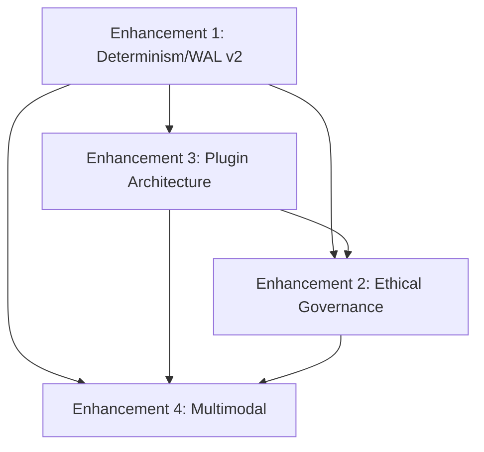
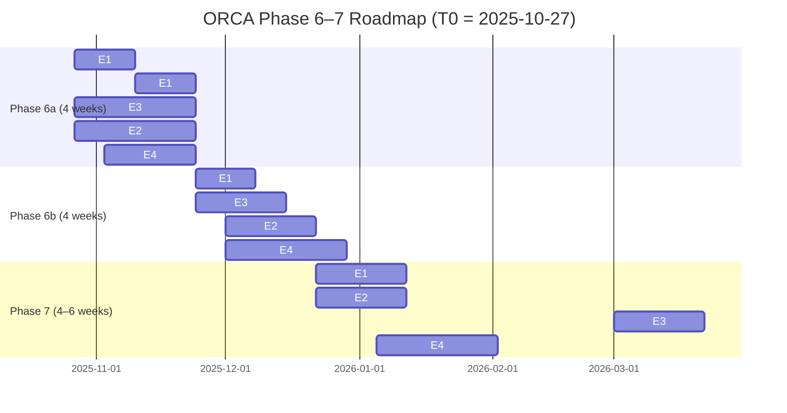

# ORCA Unified Roadmap — Phase 6–7 (Enhancements 1–4)

This document integrates Enhancement 1 (Advanced Determinism with Simulation Modes), Enhancement 2 (Ethical Governance Extensions), Enhancement 3 (Plugin Architecture for Extensibility), and Enhancement 4 (Multimodal Support for Non‑Text Agents) into a cohesive plan for delivery across Phase 6–7.

## 1) Overview

Strategic intent: E1–E4 together elevate ORCA from a text‑centric orchestrator to a production‑ready safety‑critical platform supporting deterministic replay, auditable governance, secure extensibility, and multimodal data. The roadmap preserves ORCA’s core principles: fail‑closed security, deterministic replay, event‑sourced auditability, and observability‑first operations.

Highlights by enhancement
- Enhancement 1 (E1): WAL v2, Virtual Time, External I/O Proxy + Recorder, LLM capture, Simulation Runner. Establishes the deterministic substrate for replay and simulation.
- Enhancement 2 (E2): Ethical governance taxonomy and adapters; classifier fail‑closed policy; retention tiers; enforcement order; observability SLOs.
- Enhancement 3 (E3): Secure plugin architecture (WASI default; gRPC for heavy/remote; DYLIB first‑party only). Capability model, signed manifests, hostcalls, and determinism contract.
- Enhancement 4 (E4): Content‑addressed Blob Store, BlobRef in WAL v2, streaming APIs, SDK Artifact APIs, multimodal governance adapters; video in Phase 7.

Strategic alignment to ORCA’s vision
- Production‑grade safety: fail‑closed policies everywhere (classifier failure, missing artifacts, timeouts) with auditability and deterministic replay.
- Extensibility at the edges: plugins empower tools/classifiers/storage without compromising determinism or security model.
- Enterprise readiness: retention, compliance alignment (SOC2/GDPR), observability SLOs, tiered performance budgets.

## 2) Dependency Analysis

Narrative dependencies
- E1 (WAL v2 + determinism) is the substrate for reproducibility and record/replay; required before E4 BlobRef and E3 hostcall recording achieve parity.
- E3 (Plugin host) builds atop E1 hostcall determinism for externalized tools/classifiers.
- E2 (Governance) can begin once E1 captures model/adapter outputs; E3 accelerates E2 by allowing classifier adapters as plugins.
- E4 (Multimodal) depends on E1 (WAL v2, content addressing) and E3 (plugins for multimodal tools/classifiers), and integrates with E2 for policy enforcement.

Mermaid dependency graph

Key prerequisite artifacts
- WAL v2 schemas (envelope determinism metadata; hostcall artifacts; BlobRef types)
- Hostcall catalog (time_now, rand_bytes, http_request, storage_{put,get}) with WAL capture
- Plugin manifest verification (sigstore), capability gating, sandboxing
- Blob Store (content‑addressed, zstd, encryption at rest) and gRPC streaming

## 3) Phased Implementation Timeline

Assumptions: start date T0; 12–14 weeks total. Durations include engineering, tests (≥90% coverage goals), docs, and review gates.

Mermaid Gantt (indicative)

Milestones & deliverables
- Phase 6a
  - M1: WAL v2 schemas merged; golden files; Virtual Time unit tests (E1)
  - M2: WASI runner + hostcalls w/ audit WAL capture; signed manifest verification (E3)
  - M3: Governance baseline (deny‑on‑error; taxonomy; enforcement order; perf counters) (E2)
  - M4: Blob Store GA; Image ingest E2 policy path; antivirus gate (E4)
- Phase 6b
  - M5: Replay parity passing (deterministic replays across workflows) (E1)
  - M6: gRPC runner + hot‑reload; SBOM policy gates; capability gating tested (E3)
  - M7: Classifier adapters (image safety, toxicity) wired via plugins, with RECORD/REPLAY (E2)
  - M8: Audio streaming + transcription path + tool multimodal params (E4)
- Phase 7
  - M9: Simulation modes and scenario runner (E1)
  - M10: Compliance evidence packs (SOC2 audit artifacts, GDPR retention/erasure tests) (E2)
  - M11: Plugin catalog readiness; isolation regression suites (E3)
  - M12: Video frame sampling; cold storage tier; multimodal retrieval plugins (E4)

## 4) Resource Planning

Staffing (estimates, overlapping by phase)
- Core Rust (orchestrator/WAL/hostcalls): 3 FTE
- Policy/ML integration (governance adapters, classifiers): 1.5 FTE
- Plugin Host & Sandbox (WASI/gRPC, security): 2 FTE
- SDKs (Python/TypeScript): 1.5 FTE
- SRE/Infra (storage, CI, observability): 1 FTE
- Security/Compliance (sigstore, SBOM, audits): 0.5 FTE
- QA/Tooling (harnesses, property tests, fuzz, perf): 1 FTE
- Technical Writer/PM (docs/runbooks, stakeholder comms): 0.5 FTE

FTE‑months by enhancement (approx)
- E1: 6–7 FTE‑months (schemas, recorder, replay, simulation)
- E2: 4–5 FTE‑months (taxonomy, adapters, redaction, perf/ops, evidence)
- E3: 6–7 FTE‑months (WASI/gRPC runners, manifests, hot‑reload, caps)
- E4: 5–6 FTE‑months (blob store, streaming, SDKs, tools, video/cold storage)

Infrastructure needs
- Storage: content‑addressed Blob Store with encryption; expected footprint 2–5 TB per pilot tenant (image/audio heavy) with 0.6+ dedup ratio; cold storage option for >90 days.
- Compute: AV scanning pool (2–4 vCPU per 100 MB/s ingest); classifier adapter pool; Wasmtime JIT cache nodes.
- Network: gRPC/HTTP2; OTLP export; outbound egress via proxy for external adapters; bandwidth caps per tenant.
- Third‑party: Wasmtime, Sigstore/Cosign, ClamAV (or equivalent), OTel collector, OCI‑style registry optional for large artifact tier.

## 5) Risk Register (Consolidated)

- Determinism gaps (E1/E4)
  - Risk: Missing blobs, non‑captured external I/O, nondeterministic plugins.
  - Mitigation: Fail‑closed on missing artifacts; proxy all I/O; hostcall catalog; regression replay tests; WAL schema freeze.
- Sandbox escape / capability drift (E3)
  - Risk: Plugin abuses FS/network; privilege escalation.
  - Mitigation: WASI sandbox, no ambient authority, explicit caps, egress proxy off by default; signatures/SBOM; runtime policy checks; static scans.
- Governance false negatives/positives (E2)
  - Risk: Inadequate coverage for image/audio categories.
  - Mitigation: Ensemble adapters; conservative thresholds; route‑to‑human policies; labeled evaluation sets; telemetry for drift.
- Storage cost growth (E4)
  - Risk: Large artifacts increase costs.
  - Mitigation: Dedup + zstd; tiered retention (full→hash‑only); quotas; cold storage; previews/thumbnails only when needed.
- Performance regressions (cross‑cutting)
  - Risk: Latency/CPU/throughput regressions in hot paths.
  - Mitigation: Budgets per enhancement; CI perf gates (>5% fail); profiling and tuning; chunking/backpressure.
- Compliance slippage
  - Risk: Evidence gaps for SOC2/GDPR; DSAR handling gaps.
  - Mitigation: Evidence packs; runbooks; automated verification (erasure tests, retention checks) in CI; audit logs integrity.
- Adoption friction
  - Risk: SDK changes disrupt clients; plugin authoring complexity.
  - Mitigation: Clear SDK ergonomics; samples; compatibility shims; plugin templates; staged rollouts; partner pilots.

## 6) Integration Points (How E1–E4 reinforce each other)

- E1×E3: Hostcalls and WAL capture make plugins deterministic across record/replay; missing artifacts deny by default.
- E1×E4: BlobRef recorded in WAL v2 allows replay parity for multimodal workflows; large bodies out of the WAL ensure performance and cost control.
- E2×E3: Governance classifiers implemented as plugins (WASM or gRPC) with strict capability gating.
- E2×E4: Image/audio content routed through governance adapters; EXIF/metadata scrubbing; antivirus scan gate.
- E3×E4: Multimodal tools (thumbnailers, PDF extractors, transcribers) implemented as plugins; access only via hostcalls to Blob Store.

## 7) Success Criteria (Unified)

Adoption & developer velocity
- ≥50% of targeted workflows using multimodal artifacts within two releases
- ≥10 first‑party and ≥10 third‑party plugins live; median integration time ≤5 days

Determinism & quality
- 100% replay parity for covered workflows; WAL schema stability (v2) with golden tests
- Unit+integration coverage ≥90%; property tests for chunking/reassembly and hostcall determinism

Security & compliance
- 0 critical sandbox escapes; 100% scanner failure→deny; SBOM/signature verification enforced for all plugins
- SOC2 evidence packs ready; GDPR DSAR erasure tests automated; category‑aware retention in effect

Performance & observability
- Meet budgets per enhancement (e.g., governance ≤7% overhead; BlobStore throughput ≥80 MB/s per node; WASM invoke ≤5 ms p95)
- CI perf gates active; published env manifests and seeds; dashboards for blob bytes, dedup ratio, classifier latency, plugin errors

## 8) Rollout Strategy

Feature flags & canaries
- Flags per enhancement (E1_record, E1_replay, E1_sim, E2_governance, E3_wasm, E3_grpc, E4_blob, E4_stream)
- Canary tenants/projects first; progressive rollout with SLO guardrails; auto‑rollback on error/latency SLAs breach

Backward compatibility & migration
- EnvelopeV2.attachments optional; text‑only flows unchanged; inline base64 accepted ≤64 KiB with deprecation notice and auto‑import
- Plugins: DYLIB feature gated and restricted to first‑party; recommend WASI default. Provide migration guide for external tool authors.

Rollback procedures
- Versioned WAL schemas with compatibility shim; feature flags to disable new paths; preserve read‑only access to existing blobs
- Emergency disable for plugin runners; revert to baseline governance heuristics; throttle ingest; drain mode for Blob Store

Operational readiness
- Runbooks: retention/erasure, plugin signing, incident response, blob quota breaches, scanner outages
- SLOs & alerts: dedup ratio, blob errors, governance timeouts, plugin isolation failures, replay parity regressions

---

Appendices (references to specs)
- Enhancement 1–4 specifications in Docs/ORCA-Enhancement-Research-Directive.md (A–H sections)
- Architecture, Blueprint, and Roadmap documents cross‑referenced for CI gates and budgets

